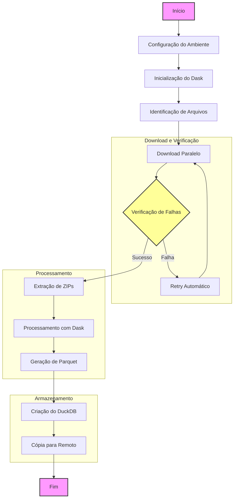

# Processador de Dados CNPJ 🏢

Este projeto automatiza o download, processamento e armazenamento dos dados públicos de CNPJ disponibilizados pela Receita Federal. Ele foi desenvolvido para ser eficiente, resiliente e fácil de usar.

## 📋 Fluxo do Processo



## ✨ Características

- **Download Paralelo**: Baixa múltiplos arquivos simultaneamente
- **Resiliência**: Sistema de retry automático em caso de falhas
- **Processamento Eficiente**: Utiliza Dask para processamento paralelo
- **Armazenamento Otimizado**: Dados em formato Parquet e DuckDB
- **Logging Detalhado**: Rastreamento completo das operações
- **Configurável**: Fácil adaptação às necessidades específicas

## 🚀 Como Usar

### Pré-requisitos

- Python 3.8 ou superior
- Espaço em disco suficiente para os arquivos
- Conexão com internet estável

### Instalação

1. **Clone o repositório**
```bash
git clone https://github.com/seu-usuario/cnpj.git
cd cnpj
```

2. **Crie um ambiente virtual**
```bash
# Windows
python -m venv venv
venv\Scripts\activate

# Linux/Mac
python3 -m venv venv
source venv/bin/activate
```

3. **Instale as dependências**
```bash
pip install -r requirements.txt
```

4. **Configure o ambiente**
   - Copie o arquivo `.env.local.example` para `.env.local`
   - Ajuste as configurações conforme necessário:
```env
# URL base dos dados da Receita Federal
URL_ORIGIN=https://dados.rfb.gov.br/CNPJ/

# Diretórios para download e processamento
PATH_ZIP=./download/      # Arquivos ZIP baixados
PATH_UNZIP=./unzip/      # Arquivos extraídos
PATH_PARQUET=./parquet/  # Arquivos Parquet processados

# Configurações do banco de dados
FILE_DB_PARQUET=cnpj.duckdb
PATH_REMOTE_PARQUET=//servidor/compartilhado/
```

### Execução

```bash
python main.py
```

## 📊 O que o Script Faz

1. **Download dos Dados**
   - Identifica os arquivos mais recentes
   - Baixa em paralelo com retry automático
   - Verifica integridade dos arquivos

2. **Processamento**
   - Extrai arquivos ZIP
   - Processa dados com Dask
   - Gera arquivos Parquet otimizados

3. **Armazenamento**
   - Cria banco de dados DuckDB
   - Organiza dados em tabelas
   - Copia para local remoto

## 📝 Logs e Monitoramento

- Logs são gerados em `logs/cnpj_process_YYYYMMDD_HHMMSS.log`
- Dashboard Dask disponível em `http://localhost:8787`
- Progresso de downloads exibido em tempo real

## ⚙️ Configurações

O arquivo `config.py` permite ajustar:

- **Processamento**
  - Número de workers Dask
  - Threads por worker
  - Limite de memória

- **Arquivos**
  - Encoding
  - Separador
  - Tipos de dados

- **Banco de Dados**
  - Número de threads
  - Configurações de compressão

## 🤝 Contribuindo

Contribuições são bem-vindas! Por favor:

1. Faça um fork do projeto
2. Crie uma branch para sua feature
3. Faça commit das mudanças
4. Push para a branch
5. Abra um Pull Request

## 📄 Licença

Este projeto está sob a licença MIT. Veja o arquivo `LICENSE` para mais detalhes.

## ⚠️ Notas

- O processamento pode levar algumas horas dependendo do hardware
- Certifique-se de ter espaço suficiente em disco
- Em caso de falhas, o sistema tentará novamente automaticamente
