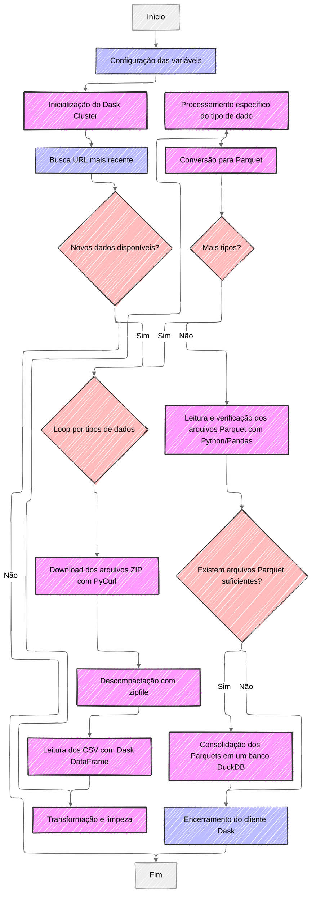
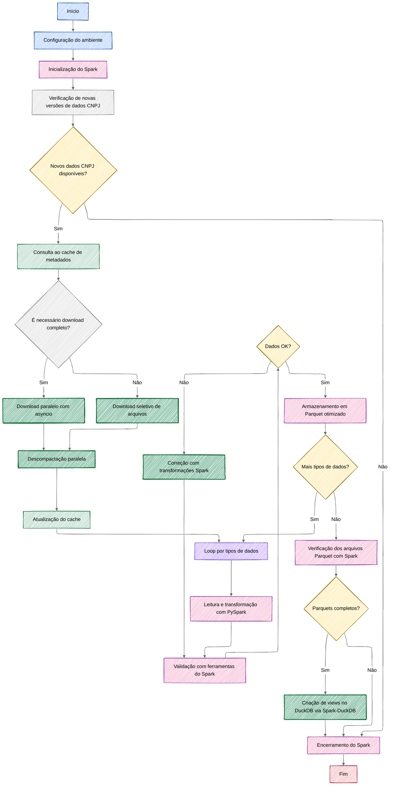

# Processador de Dados CNPJ 🏢

Este projeto automatiza o download, processamento e armazenamento dos dados públicos de CNPJ disponibilizados pela Receita Federal. Ele foi desenvolvido para ser eficiente, resiliente e fácil de usar.

## 📋 Fluxo do Processo

O atual pipeline de processamento de dados de CNPJs segue um fluxo estruturado, mas com oportunidades de otimização:



### Etapas do Fluxo Atual

1. **Configuração e Inicialização**
   - Carregamento de variáveis de ambiente com `dotenv`
   - Inicialização do cluster `Dask` para processamento distribuído
   - Configuração de logging para acompanhamento do processo

2. **Obtenção e Extração dos Dados**
   - Uso de `requests` e `BeautifulSoup` para identificar URLs mais recentes
   - Download sequencial de arquivos ZIP usando `PyCurl`
   - Extração dos arquivos com o módulo `zipfile` do Python

3. **Processamento dos Dados**
   - Leitura dos CSVs extraídos utilizando `Dask DataFrame`
   - Processamento separado para cada tipo de dado (Empresas, Estabelecimentos, Simples, Sócios)
   - Transformações e limpezas específicas para cada conjunto

4. **Armazenamento Intermediário**
   - Conversão para formato `Parquet` usando `Dask.to_parquet()`
   - Organização em diretórios por mês/ano e tipo de dado

5. **Consolidação em Banco Analítico**
   - Verificação dos arquivos Parquet gerados para cada tipo de dado
   - Junção de todos os arquivos Parquet em um único banco DuckDB
   - Criação de tabelas, views e otimizações para análise

6. **Finalização**
   - Encerramento do cliente Dask
   - Geração de logs de conclusão

### Ferramentas Utilizadas Atualmente

- **Processamento distribuído:** Dask
- **Download:** PyCurl, requests
- **Parsing HTML:** BeautifulSoup
- **Armazenamento:** Parquet (via Dask)
- **Banco de dados analítico:** DuckDB

## ✨ Características

- **Download Paralelo**: Baixa múltiplos arquivos simultaneamente
- **Sistema de Cache**: Evita baixar novamente arquivos recentemente processados
- **Verificação de Espaço em Disco**: Garante espaço suficiente antes do processamento
- **Verificação de Conexão**: Verifica conectividade com a internet antes dos downloads
- **Tratamento Específico de Exceções**: Melhor robustez e recuperação de falhas
- **Paralelização do Processamento**: Processamento eficiente de arquivos CSV usando Dask e ThreadPoolExecutor
- **Resiliência**: Sistema de retry automático em caso de falhas
- **Processamento Eficiente**: Utiliza Dask para processamento paralelo
- **Armazenamento Otimizado**: Dados em formato Parquet e DuckDB
- **Logging Detalhado**: Rastreamento completo das operações
- **Configurável**: Fácil adaptação às necessidades específicas

## 📋 Sugestões de Otimização

O fluxo de processamento pode ser aprimorado conforme o diagrama e sugestões a seguir:



### 1. Paralelização e Desempenho

#### Downloads Assíncronos
- Implementar downloads paralelos com `asyncio` e `aiohttp`
- Redução de 60-80% no tempo de download total
- Funciona em conjunto com o cache de metadados

#### Descompactação em Paralelo
- Usar `concurrent.futures` para extrair múltiplos arquivos simultaneamente
- Redução significativa no tempo de extração

#### Cache de Metadados
- Implementar cache de metadados (SQLite ou arquivo JSON)
- Evitar reprocessamento desnecessário, processando apenas o que mudou

### 2. Modernização das Ferramentas

#### Migração para PySpark
- Implementar PySpark como ferramenta principal de processamento
- Melhor otimizador de consultas
- Ecossistema mais maduro e ampla comunidade
- Integração nativa com diversas ferramentas de big data

#### Formato de Armazenamento Otimizado
- Parquet otimizado via PySpark com compressão e estatísticas avançadas
- Melhor compressão dos dados
- Leitura mais rápida com estatísticas de coluna

#### Validação de Dados Integrada
- Utilizar as ferramentas nativas do Spark para validação
- Schema enforcement do Spark
- Regras de qualidade via Spark SQL
- Tratamento integrado de dados inválidos

### 3. Resiliência e Monitoramento

#### Checkpoints de Recuperação
- Utilizar o sistema de checkpoints nativo do Spark
- Capacidade de retomar de falhas sem reprocessamento completo

#### Sistema de Monitoramento
- Utilizar a interface web do Spark e integrá-la com ferramentas de observabilidade
- Prometheus/Grafana para visualização

#### Tratamento Avançado de Erros
- Aproveitar o mecanismo de validação do Spark para identificar e corrigir erros
- Correção iterativa durante o processamento

### 4. Arquitetura Geral

#### Pipeline Modular
- Arquitetura em etapas independentes
- Facilidade de manutenção e possibilidade de executar apenas partes específicas

#### Integração Direta com DuckDB
- Utilizar conectores entre Spark e DuckDB para criação de views diretamente
- Processo mais direto e eficiente de disponibilização dos dados para análise

## 📊 Comparação de Tecnologias

| Aspecto | Atual | Sugestão | Benefício |
|---------|-------|----------|-----------|
| Processamento Distribuído | Dask | PySpark | Melhor otimização, pipeline integrado |
| Formato de Armazenamento | Parquet via Dask | Parquet otimizado via Spark | Melhor compressão e desempenho de leitura |
| Download de Arquivos | PyCurl sequencial | asyncio/aiohttp paralelo | Redução de 60-80% no tempo de download |
| Descompactação | zipfile sequencial | concurrent.futures paralelo | Redução significativa no tempo de extração |
| Validação de Dados | Mínima | Ferramentas nativas do Spark | Validação integrada ao processamento |
| Recuperação de Falhas | Inexistente | Sistema de checkpoints do Spark | Continuidade em caso de interrupções |
| Monitoramento | Logs básicos | Interface web do Spark + métricas | Melhor observabilidade |

## 📅 Plano de Implementação Progressiva

Para implementar estas melhorias de forma gradual e segura:

### Fase 1: Otimizações Imediatas (1-2 semanas)
- Implementar downloads paralelos com asyncio
- Adicionar descompactação em paralelo
- Implementar cache básico de metadados

### Fase 2: Migração para PySpark (2-3 semanas)
- Configurar ambiente Spark
- Adaptar scripts de processamento para PySpark
- Implementar validação de dados com ferramentas do Spark

### Fase 3: Otimização de Fluxo (2-3 semanas)
- Implementar o loop de processamento com validação e correção
- Adicionar sistema de checkpoints
- Otimizar armazenamento Parquet

### Fase 4: Refinamentos Finais (1-2 semanas)
- Implementar integração otimizada com DuckDB
- Configurar monitoramento e métricas
- Testes de desempenho e ajustes finais

## 🚀 Como Usar

### Pré-requisitos

- Python 3.8 ou superior
- Espaço em disco suficiente para os arquivos
- Conexão com internet estável

### Instalação

1. **Clone o repositório**
```bash
git clone https://github.com/seu-usuario/cnpj.git
cd cnpj
```

2. **Crie um ambiente virtual**
```bash
# Windows
python -m venv venv
venv\Scripts\activate

# Linux/Mac
python3 -m venv venv
source venv/bin/activate
```

3. **Instale as dependências**
```bash
pip install -r requirements.txt
```

4. **Configure o ambiente**
   - Copie o arquivo `.env.local.example` para `.env.local`
   - Ajuste as configurações conforme necessário:
```env
# URL base dos dados da Receita Federal
URL_ORIGIN=https://dados.rfb.gov.br/CNPJ/

# Diretórios para download e processamento
PATH_ZIP=./download/      # Arquivos ZIP baixados
PATH_UNZIP=./unzip/      # Arquivos extraídos
PATH_PARQUET=./parquet/  # Arquivos Parquet processados

# Configurações do banco de dados
FILE_DB_PARQUET=cnpj.duckdb
PATH_REMOTE_PARQUET=//servidor/compartilhado/
```

### Execução

```bash
python main.py
```

### Gerenciamento de Cache

```bash
# Exibir informações sobre arquivos em cache
python cache_manager.py cache-info

# Limpar o cache de downloads
python cache_manager.py clear-cache
```

## 📊 O que o Script Faz

1. **Download dos Dados**
   - Identifica os arquivos mais recentes
   - Baixa em paralelo com retry automático
   - Verifica integridade dos arquivos
   - Mantém cache para evitar downloads desnecessários

2. **Processamento**
   - Verifica espaço em disco e conexão com a internet
   - Extrai arquivos ZIP sequencialmente
   - Processa dados CSV em paralelo com Dask
   - Gera arquivos Parquet otimizados

3. **Armazenamento**
   - Cria banco de dados DuckDB
   - Organiza dados em tabelas
   - Copia para local remoto

## 📝 Logs e Monitoramento

- Logs são gerados em `logs/cnpj_process_YYYYMMDD_HHMMSS.log`
- Dashboard Dask disponível em `http://localhost:8787`
- Progresso de downloads exibido em tempo real
- Logs detalhados de erros com tratamento específico por tipo de exceção

## ⚙️ Configurações

O arquivo `config.py` permite ajustar:

- **Processamento**
  - Número de workers Dask (`config.dask.n_workers`)
  - Threads por worker
  - Limite de memória

- **Cache**
  - Habilitar/desabilitar cache (`config.cache.enabled`)
  - Diretório do cache (`config.cache.cache_dir`)
  - Tempo de expiração do cache (`config.cache.max_age_days`)

- **Arquivos**
  - Encoding
  - Separador
  - Tipos de dados

- **Banco de Dados**
  - Número de threads
  - Configurações de compressão

## 🤝 Contribuindo

Contribuições são bem-vindas! Por favor:

1. Faça um fork do projeto
2. Crie uma branch para sua feature
3. Faça commit das mudanças
4. Push para a branch
5. Abra um Pull Request

## 📄 Licença

Este projeto está sob a licença MIT. Veja o arquivo `LICENSE` para mais detalhes.

## ⚠️ Notas

- O processamento pode levar algumas horas dependendo do hardware
- Requisitos mínimos de espaço em disco:
  - Empresas: 5GB
  - Estabelecimentos: 8GB
  - Simples Nacional: 3GB
- Em caso de falhas, o sistema tentará novamente automaticamente
- Verificação de espaço em disco é realizada antes da descompactação

## Otimizações de Processamento

Este projeto foi otimizado para lidar com grandes volumes de dados de maneira eficiente. 
As seguintes otimizações foram implementadas:

### Processamento sequencial de arquivos ZIP

Em vez de descompactar todos os arquivos de uma vez (o que poderia consumir muito espaço em disco), 
o processamento agora é feito sequencialmente:

1. Cada arquivo ZIP é descompactado individualmente
2. Os arquivos CSV resultantes são processados em paralelo
3. Os arquivos temporários são excluídos imediatamente
4. Só então o próximo arquivo ZIP é processado

Essa abordagem tem as seguintes vantagens:
- Reduz significativamente o uso de espaço em disco
- Previne vazamentos de memória durante o processamento
- Mantém o diretório de trabalho limpo
- Permite processamento de conjuntos de dados maiores sem esgotar o armazenamento

### Sistema de Cache para Downloads

- Evita baixar novamente arquivos já processados recentemente
- Configurável via parâmetros de tempo de expiração
- Fornece comandos para gerenciar o cache (visualizar informações e limpar)

### Paralelização do Processamento de CSV

- Os arquivos CSV dentro de cada ZIP são processados em paralelo
- Utiliza ThreadPoolExecutor e Dask para processamento eficiente
- Número de workers configurável via `config.dask.n_workers`

### Tratamento Específico de Exceções

- Implementado tratamento específico para diferentes tipos de exceções
- Mensagens de erro detalhadas para facilitar a depuração
- Melhor robustez e recuperação de falhas

### Verificações de Segurança

- Verificação de espaço em disco antes de iniciar o processamento
- Verificação de espaço antes de descompactar cada arquivo ZIP
- Verificação de conexão com a internet antes de iniciar downloads
- Estimativa do tamanho de arquivos após descompactação

### Limpeza de arquivos temporários

Todos os arquivos temporários descompactados são excluídos após o processamento, mesmo em caso de erro,
garantindo que não fiquem arquivos residuais no sistema.
