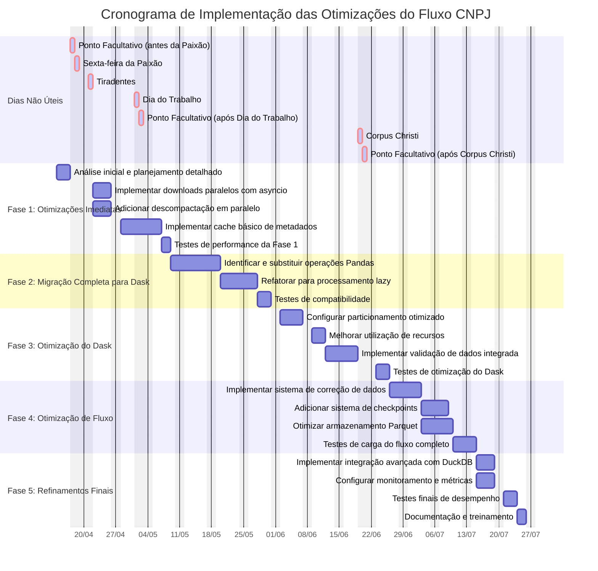

# Processador de Dados CNPJ 🏢

Este projeto automatiza o download, processamento e armazenamento dos dados públicos de CNPJ disponibilizados pela Receita Federal. Ele foi desenvolvido para ser eficiente, resiliente, modular e fácil de usar.

## Navegação

<details>
  <summary>🚀 Como Usar</summary>
  
  - [Como Usar](#-como-usar)
  - [Pré-requisitos](#pré-requisitos)
  - [Instalação](#instalação)
  - [Execução](#execução)
  - [Gerenciamento de Cache](#gerenciamento-de-cache)
  - [O que o Script Faz](#-o-que-o-script-faz)
</details>

<details>
  <summary>📋 Fluxo do Processo</summary>
  
  - [Fluxo do Processo](#-fluxo-do-processo)
  - [Fluxo Modular Atual (--step)](#fluxo-modular-atual---step)
  - [Ferramentas Utilizadas](#ferramentas-utilizadas)
</details>

<details>
  <summary>✨ Características</summary>
  
  - [Características](#-características)
</details>

<details>
  <summary>📋 Sugestões de Otimização (Histórico)</summary>
  
  - [Sugestões de Otimização (Histórico)](#-sugestões-de-otimização-histórico)
  - [1. Paralelização e Desempenho](#1-paralelização-e-desempenho)
  - [2. Migração Completa para Dask](#2-migração-completa-para-dask)
  - [3. Otimizações do Dask](#3-otimizações-do-dask)
  - [4. Resiliência e Monitoramento](#4-resiliência-e-monitoramento)
  - [5. Arquitetura Geral](#5-arquitetura-geral)
</details>

<details>
  <summary>📊 Comparação e Implementação (Histórico)</summary>
  
  - [Comparação de Tecnologias](#-comparação-de-tecnologias)
  - [Plano de Implementação Progressiva](#-plano-de-implementação-progressiva)
  - [Diagrama de Gantt do Plano de Implementação](#diagrama-de-gantt-do-plano-de-implementação)
  - [Tabela de Implementação das Branches](#tabela-de-implementação-das-branches)
</details>

<details>
  <summary>📝 Monitoramento e Configuração</summary>
  
  - [Logs e Monitoramento](#-logs-e-monitoramento)
  - [Configurações](#️-configurações)
</details>

<details>
  <summary>⚡ Otimizações de Processamento</summary>
  
  - [Otimizações de Processamento](#otimizações-de-processamento)
  - [Processamento sequencial de arquivos ZIP](#processamento-sequencial-de-arquivos-zip)
  - [Sistema de Cache para Downloads](#sistema-de-cache-para-downloads)
  - [Paralelização do Processamento de CSV](#paralelização-do-processamento-de-csv)
  - [Tratamento Específico de Exceções](#tratamento-específico-de-exceções)
  - [Verificações de Segurança](#verificações-de-segurança)
  - [Limpeza de arquivos temporários](#limpeza-de-arquivos-temporários)
  - [Melhorias na Conversão de Tipos](#melhorias-na-conversão-de-tipos)
</details>

<details>
  <summary>🤝 Contribuição e Licença</summary>
  
  - [Contribuindo](#-contribuindo)
  - [Licença](#-licença)
  - [Notas](#️-notas)
</details>

## 🚀 Como Usar

### Pré-requisitos

- Python 3.8 ou superior
- Espaço em disco suficiente para os arquivos
- Conexão com internet estável

### Instalação

1. **Clone o repositório**
```bash
git clone https://github.com/seu-usuario/cnpj.git
cd cnpj
```

2. **Crie um ambiente virtual**
```bash
# Windows
python -m venv venv
venv\Scripts\activate

# Linux/Mac
python3 -m venv venv
source venv/bin/activate
```

3. **Instale as dependências**
```bash
pip install -r requirements.txt
```

4. **Configure o ambiente**
   - Copie o arquivo `.env.local.example` para `.env.local`
   - Ajuste as configurações conforme necessário:
```env
# URL base dos dados da Receita Federal
URL_ORIGIN=https://dados.rfb.gov.br/CNPJ/

# Diretórios para download e processamento
PATH_ZIP=./download/      # Arquivos ZIP baixados
PATH_UNZIP=./unzip/      # Arquivos extraídos
PATH_PARQUET=./parquet/  # Arquivos Parquet processados

# Configurações do banco de dados
FILE_DB_PARQUET=cnpj.duckdb
PATH_REMOTE_PARQUET=//servidor/compartilhado/
```

### Execução

O script principal `main.py` aceita diversos argumentos para customizar a execução. O argumento principal para controle de fluxo é `--step`.

```bash
# 1. Execução completa (padrão: baixa, processa com Polars, cria DuckDB):
python main.py
# Equivalente a:
python main.py --step all --engine polars

# 2. Execução completa usando Pandas:
python main.py --step all --engine pandas

# 3. Execução completa usando Dask:
python main.py --step all --engine dask

# 4. Apenas baixar os arquivos ZIP mais recentes (todos os tipos):
python main.py --step download

# 5. Apenas baixar arquivos ZIP de Empresas e Sócios:
python main.py --step download --tipos empresas socios

# 6. Apenas processar ZIPs existentes para Parquet:
#    (Necessário especificar a pasta de origem dos ZIPs e a subpasta de saída Parquet)
python main.py --step process --source-zip-folder ../dados-abertos-zip --output-subfolder meu_processamento_manual --engine polars

# 7. Apenas processar ZIPs existentes de Simples e Sócios usando Dask:
python main.py --step process --source-zip-folder "D:/MeusDownloads/CNPJ_ZIPs" --output-subfolder simples_socios_dask --tipos simples socios --engine dask

# 8. Apenas criar/atualizar o banco DuckDB a partir de Parquets existentes:
#    (Necessário especificar a subpasta onde os Parquets estão)
python main.py --step database --output-subfolder meu_processamento_manual

# 9. Processar Empresas com Polars, criando subset 'empresa_privada':
#    (Execução completa, mas poderia ser --step process se os ZIPs já existirem)
python main.py --step all --tipos empresas --engine polars --output-subfolder apenas_empresas_polars --criar-empresa-privada

# 10. Processar Estabelecimentos com Polars, criando subset para SP:
#     (Execução completa, mas poderia ser --step process se os ZIPs já existirem)
python main.py --step all --tipos estabelecimentos --engine polars --output-subfolder process_sp --criar-subset-uf SP
```

**Argumentos Principais:**

*   `--step {download,process,database,all}`: Define qual(is) etapa(s) executar (padrão: `all`).
*   `--engine {pandas,dask,polars}`: Escolhe o motor de processamento para a etapa `process` (padrão: `polars`).
*   `--tipos {empresas,estabelecimentos,simples,socios}`: Filtra quais tipos de dados baixar ou processar (padrão: todos).
*   `--source-zip-folder <caminho>`: Pasta de origem dos arquivos ZIP (obrigatório para `--step process`).
*   `--output-subfolder <nome>`: Subpasta em `PATH_PARQUET` para salvar/ler Parquets (obrigatório para `--step process` e `--step database`).
*   `--criar-empresa-privada`: Flag para criar subset de empresas privadas (na etapa `process`).
*   `--criar-subset-uf <UF>`: Flag para criar subset de estabelecimentos por UF (na etapa `process`).
*   `--log-level <NÍVEL>`: Ajusta o nível de log (padrão: `INFO`).

### Gerenciamento de Cache

```bash
# Exibir informações sobre arquivos em cache
python -m src.cache_manager cache-info

# Limpar o cache de downloads
python -m src.cache_manager clear-cache
```

### Benchmarks

O projeto inclui scripts de benchmark para comparar o desempenho de diferentes bibliotecas (Pandas, Dask, Polars) no processamento dos dados:

```bash
# Benchmark para dados de Empresas
python benchmark/benchmark_empresa.py --completo --path_zip dados-abertos-zip

# Benchmark para dados do Simples Nacional
python benchmark/benchmark_simples.py --completo --path_zip dados-abertos-zip

# Benchmark para dados de Estabelecimentos (Exemplo)
python benchmark/benchmark_estabelecimento.py
```

**Observação:** Os benchmarks utilizam um sistema de **pontuação ponderada** para determinar o método mais adequado, considerando diferentes métricas de desempenho com pesos específicos (ex: Tempo Total peso 5, Espaço em Disco peso 4, etc.). Os resultados detalhados e a pontuação são exibidos no relatório final.

## 📊 O que o Script Faz

O script `main.py` orquestra um fluxo modular que pode ser executado em etapas:

1.  **Download dos Dados (`--step download` ou `all`)**
    *   Identifica os arquivos ZIP mais recentes no portal da Receita Federal.
    *   Baixa os arquivos necessários (considerando os tipos especificados) de forma assíncrona e paralela.
    *   Utiliza cache para evitar downloads repetidos.
    *   Verifica a integridade básica dos arquivos baixados.

2.  **Processamento para Parquet (`--step process` ou `all`)**
    *   Lê arquivos ZIP de uma pasta de origem (`--source-zip-folder`).
    *   Extrai o conteúdo de cada ZIP para uma subpasta temporária.
    *   Processa os arquivos de dados (CSV ou similar) usando o engine selecionado (`--engine`).
        *   Aplica transformações (renomeação, conversão de tipos, etc.).
        *   Gera arquivos Parquet otimizados e particionados na subpasta de saída (`--output-subfolder`).
        *   Cria subsets opcionais (`--criar-empresa-privada`, `--criar-subset-uf`).
    *   Limpa as subpastas temporárias.

3.  **Criação do Banco de Dados (`--step database` ou `all`)**
    *   Lê os arquivos Parquet de uma subpasta especificada (`--output-subfolder`).
    *   Cria ou atualiza um arquivo de banco de dados DuckDB (`cnpj.duckdb` por padrão).
    *   Cria tabelas no DuckDB para cada tipo de dado encontrado (empresas, estabelecimentos, socios, simples, e tabelas auxiliares como cnae, municipio, etc., se presentes na pasta `base`).
    *   Opcionalmente, faz backup do banco para um local remoto.

## 📋 Fluxo do Processo

### Fluxo Modular Atual (`--step`)

O fluxo de execução agora é controlado pelo argumento `--step`, permitindo executar partes específicas do processo:

```mermaid
graph TD
    A[Início: main.py --step <valor>] --> Args{Análise dos Argumentos}
    
    Args --> Step{Qual --step?}
    
    Step -->|download| D[Etapa Download]
    Step -->|process| P_Prep[Prepara Caminhos para Processamento]
    Step -->|database| DB_Prep[Prepara Caminhos para Database]
    Step -->|all| D
    
    D --> D_End{Fim se --step download}
    D_End -- Sim --> Z[Fim]
    D_End -- Não (step all) --> P_Prep
    
    P_Prep --> Engine{Engine Dask?}
    Engine -- Sim --> DaskInitP[Inicia Dask]
    Engine -- Não --> P[Etapa Processamento Parquet]
    DaskInitP --> P
    
    P --> P_End{Fim se --step process}
    P_End -- Sim --> DaskEndP[Encerra Dask se iniciado]
    P_End -- Não (step all) --> DB_Prep
    DaskEndP --> Z
    
    DB_Prep --> EngineDB{Engine Dask?}
    EngineDB -- Sim --> DaskInitDB[Inicia Dask (se não já iniciado)]
    EngineDB -- Não --> DB[Etapa Criação DuckDB]
    DaskInitDB --> DB
    
    DB --> DB_End{Fim se --step database}
    DB_End -- Sim --> DaskEndDB[Encerra Dask se iniciado]
    DB_End -- Não (step all) --> DaskEndAll[Encerra Dask se iniciado]
    DaskEndDB --> Z
    DaskEndAll --> Z
    
    classDef etapa fill:#cfe2ff,stroke:#084298,stroke-width:2px;
    classDef decisao fill:#fff3cd,stroke:#856404,stroke-width:1px
    classDef prep fill:#e2e3e5,stroke:#495057,stroke-width:1px
    classDef end fill:#f8d7da,stroke:#842029,stroke-width:1px

    class A,Z end
    class D,P,DB etapa
    class Args,Step,D_End,P_End,DB_End,Engine,EngineDB decisao
    class P_Prep,DB_Prep,DaskInitP,DaskEndP,DaskInitDB,DaskEndDB,DaskEndAll prep

```

**Legenda:**

*   **Retângulos Azuis:** Etapas principais do fluxo.
*   **Losangos Amarelos:** Decisões baseadas nos argumentos ou no estado.
*   **Retângulos Cinzas:** Preparação de caminhos ou inicialização/encerramento de Dask.
*   **Retângulos Vermelhos:** Pontos de início e fim.

### Ferramentas Utilizadas

*   **Processamento:** Pandas, Dask, Polars (selecionável via `--engine`)
*   **Download Assíncrono:** asyncio, aiohttp
*   **Banco de Dados:** DuckDB
*   **Manipulação de Arquivos:** zipfile, os, shutil
*   **Linha de Comando:** argparse
*   **Logging:** logging, RichHandler
*   **Configuração:** python-dotenv
*   **Utilitários:** NumPy, Rich (para progresso)

## ✨ Características

*   **Execução Modular:** Controle granular do fluxo com `--step` (`download`, `process`, `database`, `all`).
*   **Multi-Engine:** Suporte padronizado para Pandas, Dask e Polars (`--engine`), com Polars como padrão.
*   **Download Eficiente:** Assíncrono, paralelo, com cache e retentativas.
*   **Processamento Padronizado:** Lógica de extração, transformação e salvamento consistente entre os engines.
*   **Saída Otimizada:** Arquivos Parquet particionados e banco DuckDB consolidado.
*   **Configurabilidade:** Variáveis de ambiente (`.env.local`) e argumentos de linha de comando.
*   **Subsets Opcionais:** Criação de subsets por UF (`--criar-subset-uf`) ou para empresas privadas (`--criar-empresa-privada`).
*   **Logging Detalhado:** Logs em arquivo e console formatado com Rich.

## 🔄 Atualizações Recentes

*   **(Julho/2024)** Implementada execução modular com argumento `--step` (download, process, database, all), substituindo `--skip-download` e `--skip-processing`.
*   **(Julho/2024)** Padronizadas as implementações Pandas, Dask e Polars para todos os tipos de dados (Empresas, Estabelecimentos, Simples, Sócios).
*   **(Julho/2024)** Polars definido como o engine de processamento padrão (`--engine polars`).
*   **(Julho/2024)** Adicionada a flag `--criar-subset-uf` para gerar um Parquet separado com estabelecimentos de uma UF específica.
*   **(Julho/2024)** Corrigida a lógica de busca da pasta `base` na criação do DuckDB.
*   **(Julho/2024)** Refatoração do fluxo Dask para melhor alinhamento com os outros engines.

## 📋 Sugestões de Otimização (Histórico)

### 1. Paralelização e Desempenho

#### Downloads Assíncronos
- Implementar downloads paralelos com `asyncio` e `aiohttp`
- Redução de 60-80% no tempo de download total
- Funciona em conjunto com o cache de metadados

```bash
# Criar branch para implementação de downloads assíncronos
git checkout -b feature/async-downloads master
```

#### Descompactação em Paralelo
- Usar `concurrent.futures` para extrair múltiplos arquivos simultaneamente
- Redução significativa no tempo de extração

```bash
# Criar branch para implementação de descompactação paralela
git checkout -b feature/parallel-extraction master
```

#### Cache de Metadados

- Implementar cache de metadados (SQLite ou arquivo JSON)
- Evitar reprocessamento desnecessário, processando apenas o que mudou

```bash
# Criar branch para implementação do cache de metadados
git checkout -b feature/metadata-cache master
```

### 2. Migração Completa para Dask

#### Substituição de Pandas por Dask
- Identificar todas as partes do código que usam Pandas diretamente
- Converter operações Pandas para suas equivalentes em Dask
- Garantir que toda a pipeline de dados aproveite o processamento paralelo

```bash
# Criar branch para migração completa para Dask
git checkout -b feature/pandas-to-dask master
```

#### Refatoração de Código para Processamento Lazy
- Implementar padrões de processamento lazy/tardio
- Evitar materialização desnecessária de DataFrames
- Otimizar cadeia de transformações

```bash
# Criar branch para refatoração para processamento lazy
git checkout -b feature/lazy-processing master
```

### 3. Otimizações do Dask

#### Otimização do Dask
- Melhorar a configuração e utilização do Dask
- Implementar particionamento otimizado
- Utilizar funcionalidades avançadas como Dask Bag para processamento inicial

```bash
# Criar branch para otimização do Dask
git checkout -b feature/dask-optimization master
```

#### Formato de Armazenamento Otimizado

- Otimização avançada do Parquet com compressão e estatísticas
- Melhoria de esquemas e particionamento de dados
- Implementação de caching de resultados intermediários

```bash
# Criar branch para implementação de armazenamento otimizado
git checkout -b feature/optimized-storage master
```

#### Validação de Dados Integrada

- Implementar validação integrada ao fluxo de processamento
- Esquemas de validação para cada tipo de dados
- Correção automática de problemas comuns

```bash
# Criar branch para implementação de validação de dados integrada
git checkout -b feature/integrated-validation master
```

### 4. Resiliência e Monitoramento

#### Checkpoints de Recuperação

- Implementar sistema de checkpoints para recuperação de falhas
- Capacidade de retomar de falhas sem reprocessamento completo

```bash
# Criar branch para implementação de checkpoints de recuperação
git checkout -b feature/recovery-checkpoints master
```

#### Sistema de Monitoramento

- Melhorar a integração com dashboard Dask
- Adicionar métricas e monitoramento avançado
- Integração com sistemas de observabilidade

```bash
# Criar branch para implementação do sistema de monitoramento
git checkout -b feature/monitoring-system master
```

#### Tratamento Avançado de Erros

- Melhorar o sistema de tratamento de erros
- Logging detalhado com categorização de problemas
- Estratégias de recuperação por tipo de erro

```bash
# Criar branch para implementação de tratamento avançado de erros
git checkout -b feature/advanced-error-handling master
```

### 5. Arquitetura Geral

#### Pipeline Modular

- Arquitetura em etapas independentes
- Facilidade de manutenção e possibilidade de executar apenas partes específicas

```bash
# Criar branch para implementação de pipeline modular
git checkout -b feature/modular-pipeline master
```

#### Integração Avançada com DuckDB

- Melhorar a integração entre Dask e DuckDB
- Otimização de querys e carregamento
- Criação de visualizações analíticas

```bash
# Criar branch para implementação de integração com DuckDB
git checkout -b feature/duckdb-integration master
```

## 📊 Comparação e Implementação (Histórico)

| Aspecto | Atual | Sugestão de Otimização | Benefício |
|---------|-------|----------|-----------|
| Processamento Distribuído | Dask básico com Pandas em algumas partes | Dask completo com particionamento adequado | Maior velocidade de processamento e uso eficiente de recursos |
| Formato de Armazenamento | Parquet básico via Dask | Parquet otimizado com estatísticas e compressão | Melhor compressão e desempenho de leitura |
| Download de Arquivos | PyCurl sequencial | asyncio/aiohttp paralelo | Redução de 60-80% no tempo de download |
| Descompactação | zipfile sequencial | concurrent.futures paralelo | Redução significativa no tempo de extração |
| Validação de Dados | Mínima | Sistema integrado de validação | Maior qualidade dos dados e robustez |
| Recuperação de Falhas | Inexistente | Sistema de checkpoints para retomada | Continuidade em caso de interrupções |
| Monitoramento | Logs básicos | Dashboard Dask aprimorado + métricas | Melhor observabilidade |

## 📅 Plano de Implementação Progressiva

Para implementar estas melhorias de forma gradual e segura:

### Fase 1: Otimizações Imediatas (1-2 semanas)

- Implementar downloads paralelos com asyncio
- Adicionar descompactação em paralelo
- Implementar cache básico de metadados

### Fase 2: Migração Completa para Dask (2-3 semanas)

- Identificar e substituir operações Pandas por Dask
- Refatorar código para processamento lazy
- Implementar padrões de processamento distribuído em toda a pipeline

### Fase 3: Otimização do Dask (2-3 semanas)

- Configurar particionamento otimizado do Dask
- Melhorar utilização de recursos
- Implementar validação de dados integrada

### Fase 4: Otimização de Fluxo (2-3 semanas)

- Implementar sistema de correção de dados
- Adicionar sistema de checkpoints
- Otimizar armazenamento Parquet

### Fase 5: Refinamentos Finais (1-2 semanas)

- Implementar integração avançada com DuckDB
- Configurar monitoramento e métricas
- Testes de desempenho e ajustes finais


### Tabela de Implementação das Branches

| Fase | Nome da Branch              | Descrição                               | Data Início | Data Previsão | Data Conclusão | Status | Dependências |
| :--- | :-------------------------- | :-------------------------------------- | :---------- | :------------ | :------------- | :----- | :--------- |
| 1    | feature/async-downloads     | Implementação de downloads assíncronos  | 10/04/2025  | 15/04/2025    | 08/04/2025     | ✅     | -            |
| 1    | feature/parallel-extraction | Descompactação em paralelo de arquivos  | 09/04/2025  | 14/04/2025    | 08/04/2025     | ✅     | -            |
| 1    | feature/metadata-cache      | Sistema de cache de metadados           | 15/04/2025  | 24/04/2025    | 08/04/2025     | ✅     | -            |
| 2    | feature/pandas-to-dask      | Migração de operações Pandas para Dask  | 25/04/2025  | 05/05/2025    | -              | ⏳     | -            |
| 2    | feature/lazy-processing     | Refatoração para processamento lazy     | 06/05/2025  | 15/05/2025    | -              | ⏳     | feature/pandas-to-dask |
| 3    | feature/dask-optimization   | Otimização do Dask e particionamento    | 16/05/2025  | 25/05/2025    | -              | ⏳     | feature/lazy-processing |
| 3    | feature/optimized-storage   | Otimização do formato de armazenamento  | 26/05/2025  | 02/06/2025    | -              | ⏳     | feature/dask-optimization |
| 3    | feature/integrated-validation | Validação integrada de dados  | 03/06/2025  | 10/06/2025    | -              | ⏳     | feature/dask-optimization |
| 4    | feature/recovery-checkpoints| Sistema de checkpoints para recuperação | 11/06/2025  | 18/06/2025    | -              | ⏳     | feature/integrated-validation |
| 4    | feature/advanced-error-handling| Tratamento avançado de erros         | 11/06/2025  | 18/06/2025    | -              | ⏳     | feature/integrated-validation |
| 4    | feature/monitoring-system   | Implementação de sistema de monitoramento| 19/06/2025  | 26/06/2025    | -              | ⏳     | feature/recovery-checkpoints |
| 5    | feature/modular-pipeline    | Implementação de pipeline modular       | 27/06/2025  | 04/07/2025    | -              | ⏳     | feature/monitoring-system |
| 5    | feature/duckdb-integration  | Integração avançada com DuckDB          | 27/06/2025  | 04/07/2025    | -              | ⏳     | feature/monitoring-system |

### Diagrama de Gantt do Plano de Implementação

O diagrama abaixo ilustra a programação temporal das tarefas, suas interdependências e o caminho crítico do projeto de otimização:



O diagrama acima representa:

- **Duração das tarefas**: Cada barra representa uma tarefa com sua duração estimada
- **Dependências**: As tarefas conectadas mostram quais precisam ser concluídas antes de outras começarem
- **Agrupamento**: As tarefas estão organizadas nas cinco fases do plano de implementação
- **Caminho crítico**: A sequência de tarefas que determina a duração total do projeto

Este cronograma prevê aproximadamente 12-14 semanas para a implementação completa, considerando as dependências entre tarefas e tempos realistas para desenvolvimento e testes.

## Otimizações de Processamento

Este projeto foi otimizado para lidar com grandes volumes de dados de maneira eficiente. 
As seguintes otimizações foram implementadas:

### Processamento sequencial de arquivos ZIP

Em vez de descompactar todos os arquivos de uma vez (o que poderia consumir muito espaço em disco), 
o processamento agora é feito sequencialmente:

1. Cada arquivo ZIP é descompactado individualmente
2. Os arquivos CSV resultantes são processados em paralelo
3. Os arquivos temporários são excluídos imediatamente
4. Só então o próximo arquivo ZIP é processado

Essa abordagem tem as seguintes vantagens:
- Reduz significativamente o uso de espaço em disco
- Previne vazamentos de memória durante o processamento
- Mantém o diretório de trabalho limpo
- Permite processamento de conjuntos de dados maiores sem esgotar o armazenamento

### Sistema de Cache para Downloads

- Evita baixar novamente arquivos já processados recentemente
- Configurável via parâmetros de tempo de expiração
- Fornece comandos para gerenciar o cache (visualizar informações e limpar)

### Paralelização do Processamento de CSV

- Os arquivos CSV dentro de cada ZIP são processados em paralelo
- Utiliza ThreadPoolExecutor e Dask para processamento eficiente
- Número de workers configurável via `config.dask.n_workers`

### Tratamento Específico de Exceções

- Implementado tratamento específico para diferentes tipos de exceções
- Mensagens de erro detalhadas para facilitar a depuração
- Melhor robustez e recuperação de falhas

### Verificações de Segurança

- Verificação de espaço em disco antes de iniciar o processamento
- Verificação de espaço antes de descompactar cada arquivo ZIP
- Verificação de conexão com a internet antes de iniciar downloads
- Estimativa do tamanho de arquivos após descompactação

### Limpeza de arquivos temporários

Todos os arquivos temporários descompactados são excluídos após o processamento, mesmo em caso de erro,
garantindo que não fiquem arquivos residuais no sistema.

### Melhorias na Conversão de Tipos

- **Tratamento robusto para valores numéricos**: Conversão segura para Int64 com suporte para valores nulos
- **Conversão avançada de datas**: Tratamento melhorado para valores inválidos (zeros, valores vazios, etc.)
- **Processamento de valores monetários**: Conversão adequada de valores com vírgulas como separador decimal
- **Validação de tipos após conversão**: Verificação da integridade dos dados pós-conversão
- **Logs detalhados**: Rastreamento do processo de conversão para facilitar depuração

## 🤝 Contribuindo

Contribuições são bem-vindas! Por favor:

1. Faça um fork do projeto
2. Crie uma branch para sua feature
3. Faça commit das mudanças
4. Push para a branch
5. Abra um Pull Request

## 📄 Licença

Este projeto está sob a licença MIT. Veja o arquivo `LICENSE` para mais detalhes.

## ⚠️ Notas

- O processamento pode levar algumas horas dependendo do hardware
- Requisitos mínimos de espaço em disco:
  - Empresas: 5GB
  - Estabelecimentos: 8GB
  - Simples Nacional: 3GB
- Em caso de falhas, o sistema tentará novamente automaticamente
- Verificação de espaço em disco é realizada antes da descompactação

## 🛠️ Processamento e Regras de Negócio

Durante o processamento, várias transformações e regras de negócio são aplicadas, especialmente aos dados de Empresas:

1.  **Conversão de Tipos**: Colunas numéricas e de data são convertidas para os tipos apropriados.
2.  **Renomeação**: Algumas colunas são renomeadas para maior clareza (ex: `razao_social_nome_empresarial` para `razao_social`).
3.  **Extração de CPF**: 
    - O CPF (Pessoa Física) é extraído da coluna `razao_social`.
    - O script busca por padrões formatados (`xxx.xxx.xxx-xx`) ou por sequências de 11 dígitos.
    - O CPF extraído (apenas os 11 dígitos) é armazenado em uma nova coluna chamada `CPF`.
    - Esta coluna não é obrigatória, pois nem todas as razões sociais conterão um CPF.
4.  **Limpeza da Razão Social**: Após a extração do CPF, o mesmo é **removido** da coluna `razao_social` original para manter apenas o nome/razão social. Espaços extras são removidos.

Essas transformações são implementadas nas funções `apply_empresa_transformations_pandas`, `apply_empresa_transformations_polars`, e `apply_empresa_transformations_dask` dentro de `src/process/empresa.py`.

## ✨ Características

- **Automatizado**: Busca, baixa e processa os dados automaticamente.
- **Resiliente**: Possui retries em caso de falha no download e verificações de integridade.

## 🤝 Contribuindo

Contribuições são bem-vindas! Sinta-se à vontade para abrir issues ou pull requests.

## 📜 Licença

Este projeto está licenciado sob a [MIT License](LICENSE).

## 📝 Notas

- Os dados da Receita Federal são atualizados periodicamente. Execute o script regularmente para manter seus dados atualizados.
- O processamento pode exigir uma quantidade significativa de recursos (CPU, memória, disco) dependendo do volume de dados.

---
*Desenvolvido com ❤️ e Python!* 

