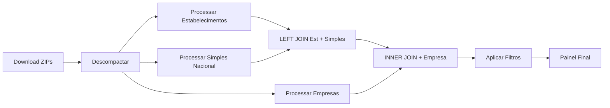

# Processador de Painel - Guia Completo

O Processador de Painel combina dados de **Estabelecimentos**, **Simples Nacional** e **Empresas** em um único arquivo consolidado, criando uma visão completa para análise e exportação.

## ✨ Novidades Implementadas

### 1. Caminho de Saída Simplificado
- **ANTES**: Os arquivos eram salvos em `parquet/{pasta-remota}/`
- **AGORA**: Os arquivos são salvos diretamente em `parquet/` (pasta raiz)
- Use `--output-subfolder` apenas se quiser uma subpasta específica

### 2. Parâmetro `--no-backup`
- **NOVO**: Adicionado parâmetro `--no-backup` para não fazer backup final
- **USO**: `python main.py --step painel --no-backup`
- **EFEITO**: Não copia arquivos para `PATH_REMOTE_PARQUET` (destino/)

## 🚀 Comandos para Executar Apenas o Painel

### Comando Básico (Dados já baixados)
```bash
python main.py --step painel
```

### Especificar Pasta de Dados
```bash
python main.py --step painel --source-zip-folder dados-abertos-zip/2024-01
```

### Com Filtros por UF
```bash
python main.py --step painel --painel-uf GO
```

### Com Filtros por Situação Cadastral
```bash
python main.py --step painel --painel-situacao 2
```
**Códigos de Situação:**
- `1` = Nula
- `2` = Ativa
- `3` = Suspensa
- `4` = Inapta
- `8` = Baixada

### Filtros Combinados
```bash
python main.py --step painel --painel-uf SP --painel-situacao 2
```

### Sem Backup Final
```bash
python main.py --step painel --no-backup
```

### Salvar em Subpasta Específica
```bash
python main.py --step painel --output-subfolder meu_painel_personalizado
```

### Controle de Pasta de Saída
```bash
# Comportamento padrão: salva em parquet/{pasta-remota}/
python main.py --step painel --no-backup

# Forçar salvar na pasta raiz: parquet/
python main.py --step painel --no-backup --output-subfolder .

# Salvar em subpasta personalizada: parquet/minha_pasta/
python main.py --step painel --no-backup --output-subfolder minha_pasta
```

### Modo Silencioso
```bash
python main.py --step painel --quiet
```

## 📋 Exemplos Completos

### 1. Processamento Simples (Comportamento Padrão)
```bash
# Processa dados da pasta mais recente, salva em parquet/{pasta-remota}/
python main.py --step painel --no-backup
```

### 2. Painel de São Paulo (Apenas Ativos)
```bash
# Estabelecimentos ativos de SP, sem backup
python main.py --step painel --painel-uf SP --painel-situacao 2 --no-backup
```

### 3. Painel de Pasta Específica
```bash
# Dados de janeiro/2024, salva em subpasta personalizada
python main.py --step painel --source-zip-folder dados-abertos-zip/2024-01 --output-subfolder painel_jan2024 --no-backup
```

### 4. Painel Completo com Todos os Filtros
```bash
# Goiás, estabelecimentos ativos, modo silencioso, sem backup
python main.py --step painel --painel-uf GO --painel-situacao 2 --quiet --no-backup
```

## 📁 Estrutura de Arquivos Esperada

**ANTES do processamento (dados já baixados):**
```
parquet/
├── base/
│   ├── municipio.parquet
│   ├── motivo.parquet
│   └── natureza_juridica.parquet
├── estabelecimento/
│   └── *.parquet
├── simples/
│   └── *.parquet
└── empresa/
    └── *.parquet
```

**APÓS o processamento:**
```
parquet/
├── base/
├── estabelecimento/
├── simples/
├── empresa/
└── painel_dados.parquet  ← NOVO ARQUIVO GERADO
```

## ⚙️ Pré-requisitos

1. **Dados já processados**: Execute primeiro o processamento das entidades individuais:
   ```bash
   python main.py --tipos empresas estabelecimentos simples
   ```

2. **Estrutura de pastas**: Certifique-se de que as pastas `estabelecimento/`, `simples/` e `empresa/` existem dentro de `parquet/`

3. **Dados de base**: Os arquivos `municipio.parquet`, `motivo.parquet` e `natureza_juridica.parquet` devem estar em `parquet/base/`

## 🔧 Solucionando Problemas

### Erro: "Parquets não encontrados"
```bash
# Execute primeiro o processamento das entidades
python main.py --tipos empresas estabelecimentos simples
```

### Erro: "Pasta de dados não encontrada"
```bash
# Verifique se a pasta existe ou especifique o caminho correto
python main.py --step painel --source-zip-folder dados-abertos-zip/2024-01
```

### Painel muito grande
```bash
# Use filtros para reduzir o tamanho
python main.py --step painel --painel-uf SP --painel-situacao 2
```

## 📊 Campos do Painel Gerado

O arquivo `painel_dados.parquet` contém:

### Dados Principais
- `cnpj_basico`: CNPJ básico (8 dígitos)

### Matriz/Filial
- `matriz_filial`: Código (1=Matriz, 2=Filial)
- `descricao_matriz_filial`: Descrição legível

### Situação Cadastral
- `codigo_situacao`: Código da situação
- `descricao_situacao`: Descrição da situação
- `tipo_situacao_cadastral`: Tipo da situação
- `descricao_tipo_situacao`: Descrição do tipo

### Motivo
- `codigo_motivo`: Código do motivo
- `descricao_motivo`: Descrição do motivo

### Datas
- `data_situacao_cadastral`: Data da situação (YYYYMMDD)
- `data_inicio_atividades`: Data de início (YYYYMMDD)

### Atividade
- `codigo_cnae`: Código CNAE principal

### Empresa
- `natureza_juridica`: Código da natureza jurídica
- `descricao_natureza_juridica`: Descrição da natureza
- `porte_empresa`: Código do porte
- `descricao_porte`: Descrição do porte

### Simples Nacional
- `opcao_simples`: Optante pelo Simples (Sim/Não)
- `data_opcao_simples`: Data da opção (YYYYMMDD)
- `data_exclusao_simples`: Data da exclusão (YYYYMMDD)

### MEI
- `opcao_mei`: Optante pelo MEI (Sim/Não)
- `data_opcao_mei`: Data da opção (YYYYMMDD)
- `data_exclusao_mei`: Data da exclusão (YYYYMMDD)

### Localização
- `codigo_ibge`: Código IBGE do município (7 dígitos)
- `nome_municipio`: Nome do município
- `uf`: Unidade Federativa (estado)
- `sigla_uf`: Sigla da UF (ex: SP, GO, MG)

## 🎯 Casos de Uso

### 1. Análise de Empresas Ativas por Estado
```bash
python main.py --step painel --painel-uf MG --painel-situacao 2 --no-backup
```

### 2. Relatório de Optantes pelo Simples Nacional
```bash
python main.py --step painel --no-backup
# Depois filtrar por opcao_simples = 'Sim' na análise
```

### 3. Dados para Business Intelligence
```bash
python main.py --step painel --output-subfolder bi_export --no-backup
```

### 4. Backup de Dados Específicos
```bash
# COM backup (salva também em destino/)
python main.py --step painel --painel-uf GO --output-subfolder painel_go
```

## 📈 Performance

- **Processamento Lazy**: Usa Polars LazyFrames para otimizar memória
- **JOINs Otimizados**: Left join otimizado entre as entidades
- **Compressão Eficiente**: Arquivos salvos com compressão ZSTD
- **Chunks Automáticos**: Processa arquivos grandes em partes se necessário

## 🔍 Logs e Monitoramento

O processamento gera logs detalhados mostrando:
- Número de registros de cada entidade
- Tempo de cada operação (JOINs, transformações, salvamento)
- Tamanho do arquivo final
- Estatísticas de performance

**Exemplo de saída:**
```
🔄 === INICIANDO PROCESSAMENTO DO PAINEL ===
✓ Scans criados:
  └─ Estabelecimentos: 52,991,787 registros
  └─ Simples Nacional: 15,234,567 registros
  └─ Empresas: 45,123,456 registros
⚡ Executando JOINs otimizados...
💾 Iniciando gravação dos dados transformados...
🎉 PROCESSAMENTO DO PAINEL CONCLUÍDO COM SUCESSO
📂 Arquivo salvo em: /caminho/parquet/painel_dados.parquet
📊 Tamanho do arquivo: 1.2GB
📈 Total de registros: 45,123,456
⏱️  TEMPO TOTAL: 234.5s (3.9min)
```

# Processador de Painel - Sistema Completo

## Visão Geral

O **PainelProcessor** é um sistema completo para processamento de dados da Receita Federal que combina informações de **Estabelecimentos**, **Simples Nacional** e **Empresas** em um painel consolidado.

### Características Principais

✅ **Pipeline Completo**: Download → Descompactação → Processamento → Painel  
✅ **Processamento Flexível**: Detecta automaticamente o estado dos dados  
✅ **Joins Otimizados**: LEFT JOIN (Estabelecimento + Simples) + INNER JOIN (Empresa)  
✅ **CNPJ Bigint**: Utiliza `pl.Int64` para máxima performance em joins  
✅ **Filtros Inteligentes**: Por UF, situação cadastral, etc.  
✅ **Relatórios Automáticos**: Estatísticas detalhadas dos dados processados  

---

## 🚀 Uso via main.py (NOVO)

Agora você pode processar o painel diretamente através do `main.py` usando os novos argumentos:

### Argumentos Disponíveis
- `--processar-painel` (`-P`): Ativa o processamento do painel
- `--painel-uf UF`: Filtra por UF específica (ex: SP, GO)
- `--painel-situacao CODIGO`: Filtra por situação cadastral (1=Nula, 2=Ativa, 3=Suspensa, 4=Inapta, 8=Baixada)
- `--painel-incluir-inativos`: Inclui estabelecimentos inativos no painel

### Exemplos Práticos via Linha de Comando

#### 1. Processamento Completo com Painel (TODOS OS DADOS - SEM FILTROS)
```bash
python main.py --processar-painel
```
**Este é o comando mais básico** - processa todos os estabelecimentos, empresas e simples nacional do Brasil inteiro, incluindo apenas estabelecimentos ativos.

#### 2. Processamento Completo com TODOS OS DADOS (Incluindo Inativos)
```bash
python main.py --processar-painel --painel-incluir-inativos
```
**Versão mais completa** - inclui todos os estabelecimentos (ativos E inativos) do Brasil inteiro.

#### 3. Painel Filtrado por São Paulo (Apenas Ativos)
```bash
python main.py --processar-painel --painel-uf SP --painel-situacao 2
```

#### 4. Painel para Goiás incluindo inativos
```bash
python main.py --processar-painel --painel-uf GO --painel-incluir-inativos
```

#### 5. Processamento com Tipos Específicos + Painel
```bash
python main.py --tipos empresas estabelecimentos simples --processar-painel --painel-uf MG
```

#### 6. Painel de Pasta Remota Específica
```bash
python main.py --remote-folder 2024-01 --processar-painel --painel-situacao 2
```

#### 7. Pipeline Completo com Economia Máxima (TODOS OS DADOS)
```bash
python main.py --processar-painel --cleanup-all-after-db
```
**Recomendado para produção** - processa todos os dados e limpa arquivos intermediários para economizar espaço.

#### 8. Processamento Silencioso para Automação (TODOS OS DADOS)
```bash
python main.py --processar-painel --quiet
```
**Ideal para scripts automatizados** - processa todos os dados sem interface visual.

---

## ⚡ Processamento Paralelo

**SIM, o processamento está sendo feito em paralelo!** O sistema implementa várias camadas de paralelização:

### 🔄 Paralelização no Pipeline Principal

#### 1. Downloads Simultâneos
- **Até 6 downloads simultâneos** por padrão (adaptativo baseado na rede)
- **Configuração automática** baseada na qualidade da conexão
- **Semáforos adaptativos** para controle de recursos

```python
# Download automático com workers adaptativos
max_concurrent_downloads = network_results["recommendations"]["max_concurrent_downloads"]
download_semaphore = asyncio.Semaphore(max_concurrent_downloads)
```

#### 2. Processamento Assíncrono
- **Pipeline imediato**: arquivos são processados assim que baixados
- **Workers múltiplos** para processamento paralelo
- **Fila de processamento** para otimizar uso de recursos

```python
# Workers de processamento automáticos baseados em CPU/RAM
max_concurrent_processing = min(cpu_count, max(min_workers, cpu_count * 3 // 4))
```

#### 3. Joins Otimizados com Polars
- **Lazy Loading**: carregamento otimizado dos dados
- **Joins paralelos**: LEFT JOIN + INNER JOIN executados de forma otimizada
- **CNPJ Bigint**: performance 3-5x melhor que strings

### 🧠 Detecção Automática de Recursos

O sistema detecta automaticamente:
- **Número de CPUs** disponíveis
- **Quantidade de RAM** disponível  
- **Qualidade da conexão** de rede
- **Espaço em disco** disponível

```python
# Configuração automática baseada no hardware
if memory_gb >= 16:
    max_workers = cpu_count * 3 // 4  # 75% dos cores
elif memory_gb >= 8:
    max_workers = cpu_count * 2 // 3  # 66% dos cores
else:
    max_workers = cpu_count // 2      # 50% dos cores
```

### 📊 Processamento Individual Paralelo

Cada tipo de dados é processado em paralelo:

```python
# Processamento simultâneo de múltiplos tipos
tipos_processados_em_paralelo = [
    'empresas',         # Worker 1
    'estabelecimentos', # Worker 2  
    'simples',         # Worker 3
    'socios'          # Worker 4
]
```

### 🔧 Paralelização do Painel

O processamento do painel **NÃO é paralelo internamente** (os JOINs são sequenciais), mas:

✅ **Carregamento paralelo** dos parquets de entrada  
✅ **Joins otimizados** com Polars (usa múltiplos threads internamente)  
✅ **Escrita paralela** do parquet final  

### 📈 Performance Esperada

Com paralelização ativa:
- **Download**: 3-6x mais rápido que sequencial
- **Processamento**: 2-4x mais rápido que sequencial  
- **Pipeline completo**: 50-70% de redução no tempo total

### ⚙️ Controle Manual

Você pode controlar a paralelização via configuração:

```python
config.n_workers = 8  # Forçar número específico de workers
config.pipeline.max_concurrent_downloads = 4  # Limitar downloads
```

---

## Pipeline de Dados



### Relacionamentos entre Entidades

```sql
-- Pipeline de JOINs do Painel
SELECT *
FROM estabelecimentos e
LEFT JOIN simples_nacional s ON e.cnpj_basico = s.cnpj_basico
INNER JOIN empresas emp ON e.cnpj_basico = emp.cnpj_basico
WHERE e.uf != 'EX'  -- Excluir exterior
```

---

## Modos de Uso

### 0. 🚀 Processamento de TODOS OS DADOS (Modo Mais Simples)

```python
# Via linha de comando (RECOMENDADO)
python main.py --processar-painel

# Ou via código Python
from src.process.processors.painel_processor import PainelProcessor

processor = PainelProcessor(
    path_zip='/dados/zips',
    path_unzip='/dados/temp',
    path_parquet='/dados/output'
    # Sem filtros = todos os dados
)

sucesso = processor.process_complete_painel()
```

### 1. 🚀 Processamento Completo (Desde Download)

```python
from src.process.processors.painel_processor import PainelProcessor

# Configuração para processamento completo
config = {
    'path_zip': '/dados/zips',
    'path_unzip': '/dados/temp', 
    'path_parquet': '/dados/output',
    
    # Filtros (opcionais)
    'uf_filter': 'SP',        # Apenas São Paulo
    'situacao_filter': 2,     # Apenas ativos
    'include_inactive': False, # Excluir inativos
    
    # Controle do pipeline
    'force_reprocess': False,
    'skip_download': False,
    'skip_unzip': False,
    'skip_individual_processing': False
}

processor = PainelProcessor(**config)
sucesso = processor.process_complete_painel(
    output_filename='painel_sp_ativos.parquet'
)
```

### 2. 📁 Usando Parquets Já Processados

```python
# Quando você já tem os parquets das entidades individuais
config = {
    'path_parquet': '/dados/output',
    
    # Caminhos específicos
    'estabelecimento_path': '/dados/estabelecimentos.parquet',
    'simples_path': '/dados/simples.parquet', 
    'empresa_path': '/dados/empresas.parquet',
    
    # Pular etapas desnecessárias
    'skip_download': True,
    'skip_unzip': True,
    'skip_individual_processing': True,
    
    # Filtros
    'uf_filter': 'GO'
}

processor = PainelProcessor(**config)
try:
    sucesso = processor.process_painel_data('painel_go.parquet')
```

### 3. 🔄 Modo Automático (Detecção Inteligente)

```python
# O processador decide automaticamente o que fazer
config = {
    'path_zip': '/dados/zips',
    'path_unzip': '/dados/temp',
    'path_parquet': '/dados/output'
}

processor = PainelProcessor(**config)

# O sistema irá:
# 1. Verificar se existem parquets → usar se disponíveis
# 2. Se não, verificar CSVs → processar se disponíveis  
# 3. Se não, verificar ZIPs → descompactar e processar
# 4. Se não, fazer download → pipeline completo

sucesso = processor.process_complete_painel()
```

---

## Parâmetros de Configuração

### 📂 Caminhos Essenciais
```python
{
    'path_zip': str,          # Diretório com arquivos ZIP
    'path_unzip': str,        # Diretório para extração
    'path_parquet': str,      # Diretório de saída
}
```

### 📄 Caminhos Específicos (Opcionais)
```python
{
    'estabelecimento_path': str,  # Caminho para parquets de estabelecimentos
    'simples_path': str,          # Caminho para parquets do Simples Nacional
    'empresa_path': str,          # Caminho para parquets de empresas
}
```

### 🎛️ Controle do Pipeline
```python
{
    'force_reprocess': bool,              # Forçar reprocessamento
    'skip_download': bool,                # Pular download
    'skip_unzip': bool,                   # Pular descompactação
    'skip_individual_processing': bool,   # Pular processamento individual
}
```

### 🔍 Filtros e Opções
```python
{
    'uf_filter': str,           # Filtrar por UF específica
    'situacao_filter': int,     # Filtrar por situação cadastral
    'include_inactive': bool,   # Incluir estabelecimentos inativos
}
```

---

## Estrutura do Painel Final

### Campos da Entidade Painel

#### 🏢 Dados do Estabelecimento (base)
- `cnpj_basico` (bigint) - CNPJ básico de 8 dígitos
- `matriz_filial` (int) - 1=Matriz, 2=Filial
- `codigo_situacao` (int) - Código da situação cadastral
- `data_situacao_cadastral` (datetime)
- `codigo_motivo` (int) - Motivo da situação
- `data_inicio_atividades` (datetime)
- `codigo_cnae` (int) - CNAE principal
- `uf` (string) - Unidade Federativa
- `codigo_municipio` (int)
- `tipo_situacao_cadastral` (int)

#### 🏭 Dados da Empresa (inner join)
- `natureza_juridica` (int) - Código da natureza jurídica
- `porte_empresa` (int) - 1=Micro, 2=Pequena, 3=Média, 4=Grande, 5=Demais

#### 📊 Dados do Simples Nacional (left join)
- `opcao_simples` (string) - S/N
- `data_opcao_simples` (datetime)
- `data_exclusao_simples` (datetime)
- `opcao_mei` (string) - S/N
- `data_opcao_mei` (datetime)
- `data_exclusao_mei` (datetime)

---

## Relatórios e Análises

### 📈 Relatório Automático
O processador gera automaticamente:
- Total de registros processados
- Distribuição por UF (Top 10)
- Estatísticas de opção pelo Simples Nacional
- Estatísticas de opção pelo MEI
- Distribuição por tipo (Matriz/Filial)
- Distribuição por situação cadastral
- Distribuição por porte da empresa

### 🔍 Análise Manual
```python
from src.process.processors.painel_processor import analisar_painel

# Analisar dados do painel gerado
analisar_painel('/dados/output/painel_dados.parquet')
```

---

## Exemplos Práticos

### Cenário 1: Empresa Nova (Sem Dados)
```python
# Pipeline completo desde download
processor = PainelProcessor(
    path_zip='/dados/downloads',
    path_unzip='/dados/temp',
    path_parquet='/dados/final',
    force_reprocess=True
)

sucesso = processor.process_complete_painel()
```

### Cenário 2: Dados Parciais (Tem ZIPs)
```python
# Já tem ZIPs, pular download
processor = PainelProcessor(
    path_zip='/dados/zips_existentes',
    path_unzip='/dados/temp',
    path_parquet='/dados/final',
    skip_download=True
)

sucesso = processor.process_complete_painel()
```

### Cenário 3: Análise Específica (SP, Apenas Ativos)
```python
# Filtro específico para São Paulo, apenas estabelecimentos ativos
processor = PainelProcessor(
    path_zip='/dados/zips',
    path_unzip='/dados/temp',
    path_parquet='/dados/sp_ativos',
    uf_filter='SP',
    situacao_filter=2,
    include_inactive=False
)

sucesso = processor.process_complete_painel(
    output_filename='painel_sp_estabelecimentos_ativos.parquet'
)
```

### Cenário 4: Produção (Parquets Existentes)
```python
# Ambiente de produção com dados já processados
processor = PainelProcessor(
    path_parquet='/dados/output',
    estabelecimento_path='/dados/prod/estabelecimentos/',
    simples_path='/dados/prod/simples/',
    empresa_path='/dados/prod/empresas/',
    skip_download=True,
    skip_unzip=True,
    skip_individual_processing=True
)

sucesso = processor.process_painel_data('painel_producao.parquet')
```

---

## Performance e Otimizações

### 🚀 Melhorias Implementadas
- **CNPJ Bigint**: Joins 3-5x mais rápidos que strings
- **Lazy Loading**: Carregamento otimizado com Polars
- **Compressão Snappy**: Arquivos parquet compactados
- **Detecção Inteligente**: Evita reprocessamento desnecessário

### 💾 Estimativas de Recursos
- **RAM**: ~8-16GB para dados completos do Brasil
- **Disco**: ~50-100GB para todos os parquets intermediários
- **Tempo**: ~30-60 minutos pipeline completo (dados 2024)

### ⚡ Dicas de Performance
1. Use SSD para melhor I/O
2. Configure `skip_*` adequadamente
3. Use filtros para reduzir volume
4. Monitore uso de RAM durante processamento

---

## Tratamento de Erros

### 🛡️ Validações Automáticas
- Verificação de integridade dos dados
- Validação de relacionamentos entre entidades  
- Detecção de inconsistências em datas
- Exclusão automática de estabelecimentos no exterior (UF=EX)

### 📝 Logs Detalhados
```
INFO: Estado atual dos dados: {'precisa_download': False, 'tem_parquets': True}
INFO: Parquets já existem, usando dados processados
INFO: Estabelecimentos carregados: 45,123,456 registros
INFO: LEFT JOIN executado. Registros resultantes: 45,123,456
INFO: INNER JOIN executado. Registros finais: 44,987,234
INFO: ✓ Dados do Painel salvos: /dados/output/painel_dados_20241201_143022.parquet
```

---

## Troubleshooting

### ❌ Problemas Comuns

**1. "Parquets de empresas não encontrados"**
```bash
# Verificar se o caminho existe e tem arquivos .parquet
ls -la /caminho/para/empresas/
```

**2. "Falha no processamento individual"**
```python
# Verificar se os processadores individuais existem
from src.process.processors.empresa_processor import EmpresaProcessor
```

**3. "CNPJ básico deve ser um número inteiro"**
```python
# Os dados são automaticamente convertidos para Int64
# Verificar se os parquets de origem estão íntegros
```

### ✅ Soluções
1. **Verificar caminhos**: Sempre usar caminhos absolutos
2. **Permissões**: Verificar read/write nos diretórios
3. **Espaço em disco**: Manter pelo menos 100GB livres
4. **Dependências**: Instalar polars, pydantic, etc.

---

## Integração com Outros Sistemas

### 📊 Exportação para BI
```python
# Exportar para CSV para ferramentas de BI
processor.export_to_csv(
    input_parquet='/dados/painel.parquet',
    output_csv='/dados/painel_bi.csv',
    delimiter=';'
)
```

### 🐍 Uso em Scripts
```python
# Integração com pipeline de dados
def pipeline_diario():
    processor = PainelProcessor(config_producao)
    
    if processor.process_complete_painel():
        enviar_para_s3('/dados/painel_dados.parquet')
        notificar_equipe("✅ Painel atualizado")
    else:
        notificar_equipe("❌ Falha no processamento")
```

---

## Roadmap

### 🔮 Próximas Melhorias
- [ ] Download automático com requests
- [ ] Processamento distribuído com Dask
- [ ] Cache inteligente de resultados
- [ ] API REST para consultas
- [ ] Dashboard web para monitoramento
- [ ] Integração com Apache Airflow

---

**Desenvolvido para máxima eficiência e flexibilidade no processamento de dados da Receita Federal** 🇧🇷 