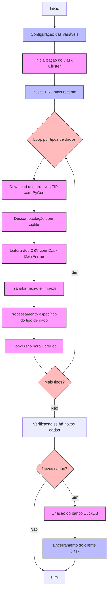
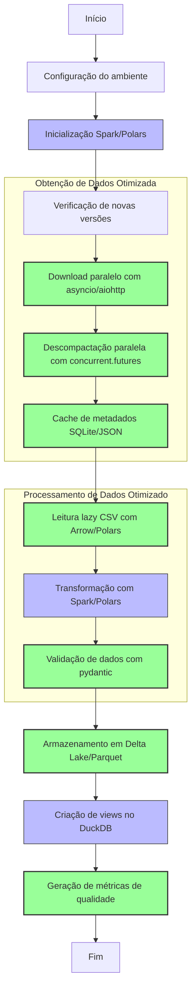

# Análise e Otimização do Fluxo de Processamento de Dados CNPJ

## Fluxo de Processamento Atual

O atual pipeline de processamento de dados de CNPJs segue um fluxo estruturado, mas com oportunidades de otimização:



### Etapas do Fluxo Atual

1. **Configuração e Inicialização**
   - Carregamento de variáveis de ambiente com `dotenv`
   - Inicialização do cluster `Dask` para processamento distribuído
   - Configuração de logging para acompanhamento do processo

2. **Obtenção e Extração dos Dados**
   - Uso de `requests` e `BeautifulSoup` para identificar URLs mais recentes
   - Download sequencial de arquivos ZIP usando `PyCurl`
   - Extração dos arquivos com o módulo `zipfile` do Python

3. **Processamento dos Dados**
   - Leitura dos CSVs extraídos utilizando `Dask DataFrame`
   - Processamento separado para cada tipo de dado (Empresas, Estabelecimentos, Simples, Sócios)
   - Transformações e limpezas específicas para cada conjunto

4. **Armazenamento Intermediário**
   - Conversão para formato `Parquet` usando `Dask.to_parquet()`
   - Organização em diretórios por mês/ano e tipo de dado

5. **Criação do Banco Analítico**
   - Geração de banco `DuckDB` a partir dos arquivos Parquet
   - Criação de tabelas, views e otimizações

6. **Finalização**
   - Encerramento do cliente Dask
   - Geração de logs de conclusão

### Ferramentas Utilizadas Atualmente

- **Processamento distribuído:** Dask
- **Download:** PyCurl, requests
- **Parsing HTML:** BeautifulSoup
- **Armazenamento:** Parquet (via Dask)
- **Banco de dados analítico:** DuckDB

## Sugestões de Otimização



### 1. Paralelização e Desempenho

#### Downloads Assíncronos
- **Atual:** Downloads sequenciais com PyCurl
- **Sugestão:** Implementar downloads paralelos com `asyncio` e `aiohttp`
- **Benefício:** Redução de 60-80% no tempo de download total

```python
async def download_files(urls):
    tasks = []
    async with aiohttp.ClientSession() as session:
        for url in urls:
            tasks.append(download_file(session, url))
        await asyncio.gather(*tasks)

async def download_file(session, url):
    async with session.get(url) as response:
        # Processamento do download
```

#### Descompactação em Paralelo
- **Atual:** Descompactação sequencial dos arquivos ZIP
- **Sugestão:** Usar `concurrent.futures` para extrair múltiplos arquivos simultaneamente
- **Benefício:** Redução significativa no tempo de extração

```python
with concurrent.futures.ThreadPoolExecutor(max_workers=8) as executor:
    futures = [executor.submit(extract_zip, zip_file) for zip_file in zip_files]
    for future in concurrent.futures.as_completed(futures):
        # Processar resultado
```

#### Cache de Metadados
- **Atual:** Reprocessamento completo de arquivos mesmo com poucas alterações
- **Sugestão:** Implementar cache de metadados (SQLite ou arquivo JSON)
- **Benefício:** Evitar reprocessamento desnecessário, processando apenas o que mudou

### 2. Modernização das Ferramentas

#### Migração do Dask para Alternativas Mais Eficientes
- **Atual:** Uso exclusivo de Dask para processamento distribuído
- **Sugestões:**
  - **PySpark:** Para processamento distribuído mais robusto e maduro
  - **Polars:** Para processamento em memória ultra-rápido
- **Benefícios:** 
  - PySpark: Melhor otimizador de consultas, ecossistema mais maduro
  - Polars: Até 10x mais rápido que Pandas para operações em memória

#### Formato de Armazenamento Aprimorado
- **Atual:** Parquet simples
- **Sugestão:** Considerar Delta Lake ou Apache Iceberg
- **Benefícios:** 
  - Controle de versão dos dados
  - Transações ACID
  - Suporte a upserts e deletes

#### Validação de Dados
- **Atual:** Validação mínima ou inexistente
- **Sugestão:** Adicionar validação de schema e qualidade
- **Ferramentas recomendadas:** 
  - `pydantic` para validação de schema
  - `great_expectations` para validação de qualidade de dados

```python
from pydantic import BaseModel, Field

class Empresa(BaseModel):
    cnpj_basico: str
    razao_social: str = Field(..., min_length=1)
    natureza_juridica: int
    # outros campos
```

### 3. Resiliência e Monitoramento

#### Checkpoints de Recuperação
- **Atual:** Difícil retomar processamento interrompido
- **Sugestão:** Implementar pontos de verificação para recuperação
- **Benefício:** Capacidade de retomar de falhas sem reprocessamento completo

#### Sistema de Monitoramento
- **Atual:** Logs básicos
- **Sugestão:** Coletar métricas de desempenho e qualidade
- **Ferramentas:** Prometheus/Grafana para visualização, ou solução mais simples com CSV/Excel

#### Tratamento Avançado de Erros
- **Atual:** Tratamento básico de erros
- **Sugestão:** Estratégias de retry para operações falhas e dead letter queue
- **Benefício:** Maior resiliência e capacidade de correção manual

### 4. Arquitetura Geral

#### Pipeline Modular
- **Atual:** Fluxo monolítico
- **Sugestão:** Dividir em etapas independentes
- **Benefício:** Facilidade de manutenção e possibilidade de executar apenas partes específicas

#### Controle de Versão dos Dados
- **Atual:** Sem versionamento formal
- **Sugestão:** Implementar versionamento dos conjuntos processados
- **Benefício:** Facilidade para auditorias e rollbacks

#### Consideração de Processamento em Streaming
- **Atual:** Processamento em lote (batch)
- **Sugestão:** Avaliar modelo de processamento contínuo
- **Benefício:** Atualizações mais frequentes e menor latência

## Comparação de Tecnologias

| Aspecto | Atual | Sugestão | Benefício |
|---------|-------|----------|-----------|
| Processamento Distribuído | Dask | PySpark ou Dask+Polars | Melhor otimização, desempenho superior |
| Formato de Armazenamento | Parquet | Delta Lake/Parquet | Transações ACID, versionamento |
| Download de Arquivos | PyCurl sequencial | asyncio/aiohttp paralelo | Redução de 60-80% no tempo de download |
| Descompactação | zipfile sequencial | concurrent.futures paralelo | Redução no tempo de processamento |
| Validação de Dados | Mínima | pydantic/great_expectations | Maior qualidade e confiabilidade |
| Monitoramento | Logs básicos | Sistema de métricas | Melhor observabilidade |

## Plano de Implementação Progressiva

Para implementar estas melhorias de forma gradual e segura:

### Fase 1: Otimizações Imediatas (1-2 semanas)
- Implementar downloads paralelos com asyncio
- Adicionar descompactação em paralelo
- Implementar cache básico de metadados

### Fase 2: Melhorias de Confiabilidade (2-3 semanas)
- Adicionar validação de dados com pydantic
- Implementar checkpoints de recuperação
- Melhorar tratamento de erros

### Fase 3: Modernização de Ferramentas (3-4 semanas)
- Migrar parte do processamento para Polars
- Testar PySpark para componentes críticos
- Implementar versionamento básico dos dados

### Fase 4: Refinamentos Finais (2-3 semanas)
- Consolidar arquitetura modular
- Implementar sistema de monitoramento
- Otimizar o banco DuckDB final

## Conclusão

O fluxo atual possui uma estrutura sólida, mas pode se beneficiar significativamente de otimizações modernas de paralelismo e ferramentas mais eficientes. As melhorias sugeridas visam reduzir o tempo total de processamento, aumentar a confiabilidade e facilitar a manutenção futura.

A implementação destas melhorias pode ser feita de forma incremental, priorizando as otimizações de maior impacto e menor risco. Com estas mudanças, o sistema estará mais preparado para lidar com volumes crescentes de dados e requisitos futuros de processamento. 