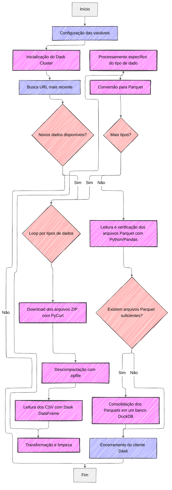
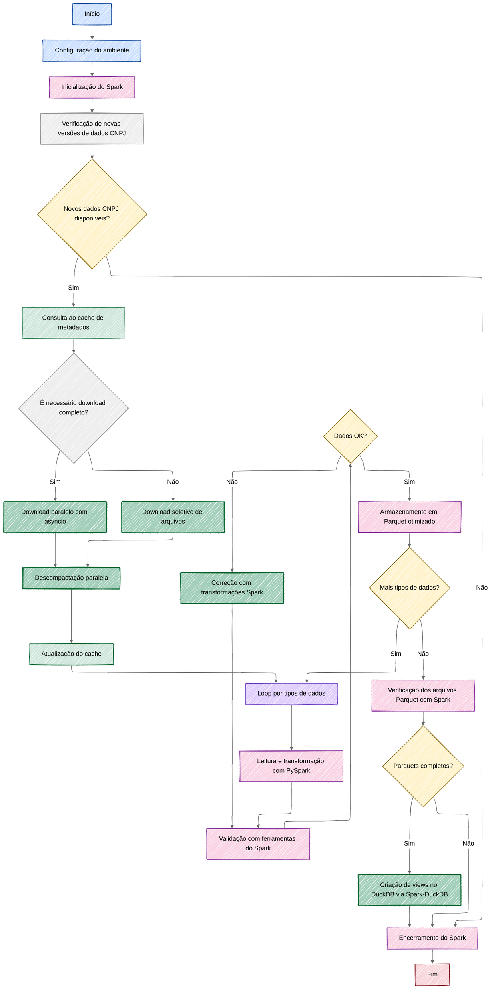
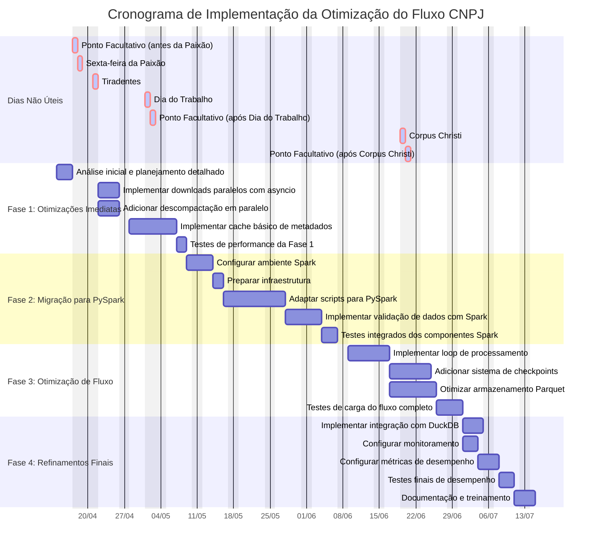

# Análise e Otimização do Fluxo de Processamento de Dados CNPJ

## Fluxo de Processamento Atual

O atual pipeline de processamento de dados de CNPJs segue um fluxo estruturado, mas com oportunidades de otimização:



### Etapas do Fluxo Atual

1. **Configuração e Inicialização**
   - Carregamento de variáveis de ambiente com `dotenv`
   - Inicialização do cluster `Dask` para processamento distribuído
   - Configuração de logging para acompanhamento do processo

2. **Obtenção e Extração dos Dados**
   - Uso de `requests` e `BeautifulSoup` para identificar URLs mais recentes
   - Download sequencial de arquivos ZIP usando `PyCurl`
   - Extração dos arquivos com o módulo `zipfile` do Python

3. **Processamento dos Dados**
   - Leitura dos CSVs extraídos utilizando `Dask DataFrame`
   - Processamento separado para cada tipo de dado (Empresas, Estabelecimentos, Simples, Sócios)
   - Transformações e limpezas específicas para cada conjunto

4. **Armazenamento Intermediário**
   - Conversão para formato `Parquet` usando `Dask.to_parquet()`
   - Organização em diretórios por mês/ano e tipo de dado

5. **Consolidação em Banco Analítico**
   - Verificação dos arquivos Parquet gerados para cada tipo de dado
   - Junção de todos os arquivos Parquet em um único banco DuckDB
   - Criação de tabelas, views e otimizações para análise

6. **Finalização**
   - Encerramento do cliente Dask
   - Geração de logs de conclusão

### Ferramentas Utilizadas Atualmente

- **Processamento distribuído:** Dask
- **Download:** PyCurl, requests
- **Parsing HTML:** BeautifulSoup
- **Armazenamento:** Parquet (via Dask)
- **Banco de dados analítico:** DuckDB

## Sugestões de Otimização



### 1. Paralelização e Desempenho

#### Downloads Assíncronos

- **Atual:** Downloads sequenciais com PyCurl
- **Sugestão:** Implementar downloads paralelos com `asyncio` e `aiohttp`
- **Benefício:** Redução de 60-80% no tempo de download total
- **Integração:** Funciona em conjunto com o cache de metadados para evitar downloads desnecessários

```python
async def download_files(urls):
    tasks = []
    async with aiohttp.ClientSession() as session:
        for url in urls:
            tasks.append(download_file(session, url))
        await asyncio.gather(*tasks)

async def download_file(session, url):
    async with session.get(url) as response:
        # Processamento do download
```

#### Descompactação em Paralelo

- **Atual:** Descompactação sequencial dos arquivos ZIP
- **Sugestão:** Usar `concurrent.futures` para extrair múltiplos arquivos simultaneamente
- **Benefício:** Redução significativa no tempo de extração
- **Integração:** Alimenta diretamente o pipeline de processamento do PySpark

```python
with concurrent.futures.ThreadPoolExecutor(max_workers=8) as executor:
    futures = [executor.submit(extract_zip, zip_file) for zip_file in zip_files]
    for future in concurrent.futures.as_completed(futures):
        # Processar resultado
```

#### Cache de Metadados

- **Atual:** Reprocessamento completo de arquivos mesmo com poucas alterações
- **Sugestão:** Implementar cache de metadados (SQLite ou arquivo JSON)
- **Benefício:** Evitar reprocessamento desnecessário, processando apenas o que mudou
- **Função:** Determina automaticamente se é necessário download completo ou seletivo

### 2. Modernização das Ferramentas

#### Migração para PySpark

- **Atual:** Uso exclusivo de Dask para processamento distribuído
- **Sugestão:** Implementar PySpark como ferramenta principal de processamento
- **Benefícios:** 
  - Melhor otimizador de consultas
  - Ecossistema mais maduro e ampla comunidade
  - Integração nativa com diversas ferramentas de big data
  - Pipeline de processamento completo desde a leitura até a validação

#### Formato de Armazenamento Otimizado

- **Atual:** Parquet simples via Dask
- **Sugestão:** Parquet otimizado via PySpark com compressão e estatísticas avançadas
- **Benefícios:** 
  - Melhor compressão dos dados
  - Leitura mais rápida com estatísticas de coluna
  - Compatibilidade direta com ferramentas analíticas

#### Validação de Dados Integrada

- **Atual:** Validação mínima ou inexistente
- **Sugestão:** Utilizar as ferramentas nativas do Spark para validação
- **Componentes:** 
  - Schema enforcement do Spark
  - Regras de qualidade via Spark SQL
  - Tratamento integrado de dados inválidos
- **Exemplo:**

```python
# Definição e aplicação de esquema com Spark
from pyspark.sql.types import StructType, StructField, StringType, IntegerType

# Definição do esquema
empresa_schema = StructType([
    StructField("cnpj_basico", StringType(), nullable=False),
    StructField("razao_social", StringType(), nullable=False),
    StructField("natureza_juridica", IntegerType(), nullable=True)
])

# Validação com regras SQL
validations = spark.sql("""
    SELECT * FROM empresas 
    WHERE length(cnpj_basico) = 8 
    AND razao_social IS NOT NULL
""")
```

### 3. Resiliência e Monitoramento

#### Checkpoints de Recuperação

- **Atual:** Difícil retomar processamento interrompido
- **Sugestão:** Utilizar o sistema de checkpoints nativo do Spark
- **Benefício:** Capacidade de retomar de falhas sem reprocessamento completo

#### Sistema de Monitoramento

- **Atual:** Logs básicos
- **Sugestão:** Utilizar a interface web do Spark e integrá-la com ferramentas de observabilidade
- **Ferramentas:** Prometheus/Grafana para visualização, ou exportação de métricas do Spark

#### Tratamento Avançado de Erros

- **Atual:** Tratamento básico de erros
- **Sugestão:** Aproveitar o mecanismo de validação do Spark para identificar e corrigir erros
- **Benefício:** Correção iterativa durante o processamento, conforme implementado no fluxograma

### 4. Arquitetura Geral

#### Pipeline Modular

- **Atual:** Fluxo monolítico
- **Sugestão:** Arquitetura em etapas independentes conforme o fluxograma otimizado
- **Benefício:** Facilidade de manutenção e possibilidade de executar apenas partes específicas

#### Integração Direta com DuckDB

- **Atual:** Conversão manual de Parquet para DuckDB
- **Sugestão:** Utilizar conectores entre Spark e DuckDB para criação de views diretamente
- **Benefício:** Processo mais direto e eficiente de disponibilização dos dados para análise

## Comparação de Tecnologias

| Aspecto | Atual | Sugestão | Benefício |
|---------|-------|----------|-----------|
| Processamento Distribuído | Dask | PySpark | Melhor otimização, pipeline integrado |
| Formato de Armazenamento | Parquet via Dask | Parquet otimizado via Spark | Melhor compressão e desempenho de leitura |
| Download de Arquivos | PyCurl sequencial | asyncio/aiohttp paralelo | Redução de 60-80% no tempo de download |
| Descompactação | zipfile sequencial | concurrent.futures paralelo | Redução significativa no tempo de extração |
| Validação de Dados | Mínima | Ferramentas nativas do Spark | Validação integrada ao processamento |
| Recuperação de Falhas | Inexistente | Sistema de checkpoints do Spark | Continuidade em caso de interrupções |
| Monitoramento | Logs básicos | Interface web do Spark + métricas | Melhor observabilidade |

## Plano de Implementação Progressiva

Para implementar estas melhorias de forma gradual e segura:

### Fase 1: Otimizações Imediatas (1-2 semanas)

- Implementar downloads paralelos com asyncio
- Adicionar descompactação em paralelo
- Implementar cache básico de metadados

### Fase 2: Migração para PySpark (2-3 semanas)

- Configurar ambiente Spark
- Adaptar scripts de processamento para PySpark
- Implementar validação de dados com ferramentas do Spark

### Fase 3: Otimização de Fluxo (2-3 semanas)

- Implementar o loop de processamento com validação e correção
- Adicionar sistema de checkpoints
- Otimizar armazenamento Parquet

### Fase 4: Refinamentos Finais (1-2 semanas)

- Implementar integração otimizada com DuckDB
- Configurar monitoramento e métricas
- Testes de desempenho e ajustes finais

### Diagrama de Gantt do Plano de Implementação

O diagrama abaixo ilustra a programação temporal das tarefas, suas interdependências e o caminho crítico do projeto de otimização:



O diagrama acima representa:

- **Duração das tarefas**: Cada barra representa uma tarefa com sua duração estimada
- **Dependências**: As tarefas conectadas mostram quais precisam ser concluídas antes de outras começarem
- **Agrupamento**: As tarefas estão organizadas nas quatro fases do plano de implementação
- **Caminho crítico**: A sequência de tarefas que determina a duração total do projeto

Este cronograma prevê aproximadamente 8-10 semanas para a implementação completa, considerando as dependências entre tarefas e tempos realistas para desenvolvimento e testes.

## Conclusão

O fluxo atual possui uma estrutura sólida, mas pode se beneficiar significativamente de otimizações modernas de paralelismo e ferramentas mais eficientes. As melhorias sugeridas visam reduzir o tempo total de processamento, aumentar a confiabilidade e facilitar a manutenção futura.

A implementação destas melhorias pode ser feita de forma incremental, priorizando as otimizações de maior impacto e menor risco. Com estas mudanças, o sistema estará mais preparado para lidar com volumes crescentes de dados e requisitos futuros de processamento. 